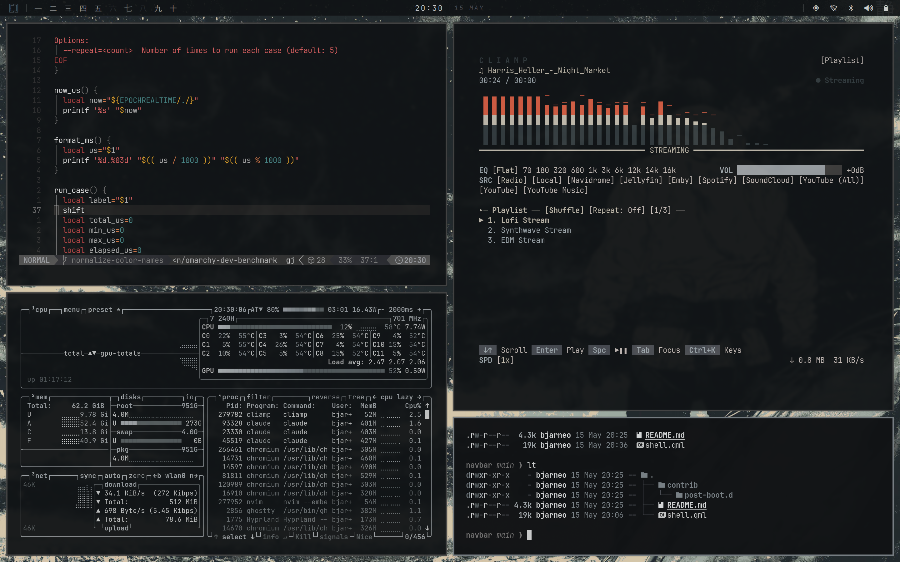

# desktop

A Quickshell config that runs the navbar and omni-menu command palette in a single process. One daemon, one live palette, atomic theme swaps across bar and palette.



## Quick start

```sh
git clone https://github.com/bjarneo/quickshell ~/.config/quickshell

# disable omarchy's waybar (also bound to SUPER + SHIFT + SPACE)
omarchy toggle waybar

# autostart on every Hyprland session
install -m 755 ~/.config/quickshell/desktop/contrib/post-boot.d/quickshell-desktop \
  ~/.config/omarchy/hooks/post-boot.d/quickshell-desktop

# launch once now
qs -n -d -c desktop
```

Reload the Hyprland session (or run `omarchy-hook post-boot`) and the bar appears with the palette one keybind away.

## Hyprland keybinds

```
bind = SUPER, SPACE, exec, qs -c desktop ipc call palette toggle
bind = SUPER, P,     exec, qs -c desktop ipc call screenshots toggle
bind = SUPER, V,     exec, qs -c desktop ipc call videos toggle
bind = SUPER, D,     exec, qs -c desktop ipc call display toggle
bind = SUPER, W,     exec, qs -c desktop ipc call weather toggle
bind = SUPER, A,     exec, qs -c desktop ipc call aether toggle
bind = SUPER, C,     exec, qs -c desktop ipc call calendar toggle
```

The navbar omarchy/menu button calls `toggle()` on the sibling palette in-process, no IPC round-trip or subprocess.

## What's inside

| Component | What it does |
| --- | --- |
| Bar | Kanji workspace markers, telemetry (cpu, mem, bt, wifi, audio, battery), centred clock, click-through popups for calendar, screenshots, videos, display, weather, aether blueprints. |
| Omni-menu | Full-screen command palette over installed apps and the omarchy-menu (Style, Setup, Install, Remove, Update, System, Toggle, Trigger, Capture, Share, Learn), file search, GitHub repo search, processes, theme picker. |
| Theme | Shared live palette sourced from `~/.config/omarchy/current/theme/colors.toml`. Drift animation runs on theme swap so bar + palette breathe in sync. |

## Bar layout

```
left   | omarchy | sep | ws1..ws10 |
center | HH:MM |
right  | weather | display | camera | filmstrip | sep | cpu | bt | wifi | audio | battery | edge |
```

- Click the omarchy glyph to toggle the omni-menu palette. Right-click runs `xdg-terminal-exec`.
- Click the clock to open the calendar popup.
- Click a kanji to `hyprctl dispatch workspace N`.
- Click weather for the forecast popup. Right-click force-refreshes.
- Click display for warmth, brightness, gamma sliders + presets.
- Click camera to browse `~/Pictures/screenshot-*.png`. Right-click captures a new one.
- Click filmstrip to browse recent videos in `~/Videos`. Right-click opens the folder.
- Click audio for `omarchy-launch-audio`. Right-click toggles mute.
- Click battery for the power menu.
- Click the edge arrow to cycle the bar between top, right, bottom, left.

## Palette

Type to filter across titles, categories, and a curated synonym list. Drill into any category, run with Enter.

| Key | Action |
| --- | --- |
| Type | Filter by title, category, and per-item synonyms |
| Up / Down / Tab / Shift+Tab | Move selection, wraps at both ends |
| PageUp / PageDown | Jump 8 rows, clamps at both ends |
| Home / End | Jump to first / last result |
| Enter | Drill into a category, or run the selected action |
| Ctrl + S | Star / unstar the current row |
| Backspace | Delete a char; when empty, walk back up one level |
| Esc | Clear query, then unwind drill-down, then close |

### Scoring

Every entry is indexed against three fields. All query tokens must match somewhere; scores stack per token.

| Match | Weight |
| --- | --- |
| Title prefix | 100 |
| Title substring | 60 |
| Keywords substring | 20 |
| Category substring | 10 |

Top 250 sorted by score, nav-rows-first on ties, then alpha.

### Drill-downs

At root the first rows are category navigators (`Apps >`, `Style >`, `Files >`, `GitHub >`, `Processes >`, `Themes >`, ...). Activating one filters the list and updates the header breadcrumb. Files and GitHub drills pivot to fd / gh CLI output; Processes drills into a kill list; Themes drills into the omarchy theme switcher with swatch + preview pane.

## Theme

Reads `~/.config/omarchy/current/theme/colors.toml` and remaps:

| toml key | role | maps to |
| --- | --- | --- |
| background | surface base | `paper` |
| foreground | primary text | `ink` |
| color7 | secondary bright text | `inkDeep` |
| color8 | muted decoration | `sumi` |
| accent | info accent | `indigo` |
| color1 | active marker, alerts | `seal` (drift-modulated) |

Parsing lives in `Palette.js`: `parse(text)` returns a plain object keyed by semantic name, `apply(theme, palette)` writes it onto the live `Theme` instance.

### Hook-driven refresh

`omarchy theme set <name>` rewrites `colors.toml` atomically (`rm -rf` + `mv` of the whole theme directory), which breaks inotify-style watching. The desktop instead relies on omarchy's `~/.config/omarchy/hooks/theme-set` hook to push a refresh:

```sh
# ~/.config/omarchy/hooks/theme-set

# (whatever else the hook does — cava reload, etc.)

# Broadcast the swap on the session bus for any external listener.
theme_name="$(cat "$HOME/.config/omarchy/current/theme.name" 2>/dev/null)"
dbus-send --session --type=signal /org/omarchy/Theme \
    org.omarchy.Theme.Changed "string:${theme_name}" 2>/dev/null || true

# Drive the in-shell palette refresh.
qs -c desktop ipc call theme reload 2>/dev/null || true
```

The IPC call is what actually repaints the bar and palette. The DBus signal is for *anyone else* who wants to react (cliamp, gtk reload helpers, your own scripts) — Quickshell 0.3.0 has no native DBus listener, so the in-shell path is IPC. Both lines no-op silently when the desktop isn't running.

On reload, `seal` saturation rides a 200ms rise and 2.8s taper (`driftDelay` + `driftAnim` in `Theme.qml`), so a theme swap reads as a deliberate breath rather than a hard cut.

### External listeners

Any process can subscribe to the broadcast directly:

```sh
dbus-monitor --session "type='signal',interface='org.omarchy.Theme',member='Changed'"
```

Each emission carries the new theme name as the signal's single string argument.

## IPC

External keybinds and scripts drive each surface:

```sh
qs -c desktop ipc call palette toggle        # omni-menu
qs -c desktop ipc call screenshots toggle    # screenshots browser
qs -c desktop ipc call videos toggle         # video browser
qs -c desktop ipc call display toggle        # display sliders
qs -c desktop ipc call weather toggle        # weather popup
qs -c desktop ipc call aether toggle         # aether blueprint picker
qs -c desktop ipc call calendar toggle       # calendar
```

`open`, `close`, and (where relevant) `refresh`, `reset`, `blank` are also exposed. `qs -c desktop ipc show` lists everything.

## Weather location

Defaults to wttr.in's IP geolocation. Override by writing a single line to `~/.config/omarchy/weather/location`:

```
Oslo
```

Or any of: `City, Country` | `LHR` (IATA) | `94103` (zip) | `60.42,11.24` (lat,lon). Click the subtitle inside the weather popup to open the file in your editor; the bar re-fetches on save.

## App scan

Apps are scanned once at startup via a single Python `configparser` pass (NoDisplay/Hidden filtered, `%U`/`%f` field codes stripped, deduped by name) across `~/.local/share/applications`, `/usr/share/applications`, Flatpak, and Snap. Trigger a rescan with `qs -c desktop ipc call palette refresh`.

App icons resolve via `Quickshell.iconPath()` for theme names and `file://` for absolute paths, then render through `MultiEffect colorization` so they paint as flat-tinted silhouettes in the live palette (ink at rest, seal on the selected row).

## Adding palette entries

Edit `omarchyItems` in `Data.js`. Each row is:

```js
{ title: "My Action", icon: "", category: "Style",
  keywords: "synonym one synonym two related terms",
  exec: "my-command --flag" }
```

- `category` decides which drill-in surfaces the row.
- `keywords` is a space-separated synonym list. Anything you'd plausibly type to find this row goes here.
- `exec` is fed to `setsid -f uwsm-app -- bash -c "<exec>"`, so pipes, `||`, `&&` all work.

## Customization

Everything lives under `desktop/`. Common tweaks:

| Want to change | Where |
| --- | --- |
| Bar height | `barHeight` in `Navbar.qml`. |
| Workspace count | `Repeater { model: 10 ... }` in `Bar.qml`. |
| Bar font | `mono` / `serif` in `Navbar.qml`. |
| Palette font | `mono` / `serif` in `OmniMenu.qml`. |
| Palette result cap | `maxResults` in `OmniMenu.qml`. |
| Score weights | `scPrefix`, `scTitle`, `scKw`, `scCat` in `OmniMenu.qml`. |
| Telemetry interval | `Timer { interval: ... }` blocks in `Navbar.qml`. |
| Drift animation | `driftDelay` / `driftAnim` in `Theme.qml`. |

Quickshell hot-reloads on save, so edits show up live.

## Autostart

`desktop/contrib/post-boot.d/quickshell-desktop` is a drop-in for omarchy's hook system. It runs at session start with:

```sh
#!/bin/bash
qs -n -d -c desktop
```

`-d` daemonizes, `-n` makes it idempotent.

## Requirements

| Package | Why |
| --- | --- |
| quickshell | Runtime. |
| hyprland | Workspace state, keybinds, autostart hook. |
| omarchy | Live theme palette and the `omarchy-menu <verb>` dispatcher. |
| python3 | Parses `.desktop` files. |
| uwsm | `uwsm-app` scope wrapper for spawned apps. |
| pamixer | Audio mute query. |
| bluetoothctl | Bluetooth power and connection state. |
| nmcli | Wifi signal strength when no ethernet is up. |
| brightnessctl | Backlight slider in the display popup. |
| hyprsunset | Color temperature and gamma in the display popup. |
| jq, curl | Weather popup data fetch from wttr.in. |
| fd, gh | File search and GitHub repo search drill-downs (optional). |
| dragon-drop | Drag-and-drop hand-off for the videos popup (optional, AUR). |

## Troubleshooting

| Symptom | Fix |
| --- | --- |
| `Could not open config file at "desktop"` | Use `-c desktop`, not `-p desktop`. `-c` resolves to `~/.config/quickshell/desktop/shell.qml`. |
| Palette doesn't appear on SUPER + SPACE | Confirm the keybind targets `qs -c desktop ipc call palette toggle`, not the old `omni-menu/toggle.sh`. |
| Theme colours don't update on `omarchy theme set` | Check `~/.config/omarchy/current/theme.name` exists and is being rewritten. The desktop uses it as the reload trigger. |
| Workspace switch feels laggy | Bump `wsProbe`'s `Timer { interval: ... }` from 500ms down to 150ms in `Navbar.qml`, or wire it to Hyprland's IPC socket. |
| Qt version mismatch warning | `quickshell` was built against an older Qt minor. Rebuild the package against your current Qt. |

## License

MIT.
